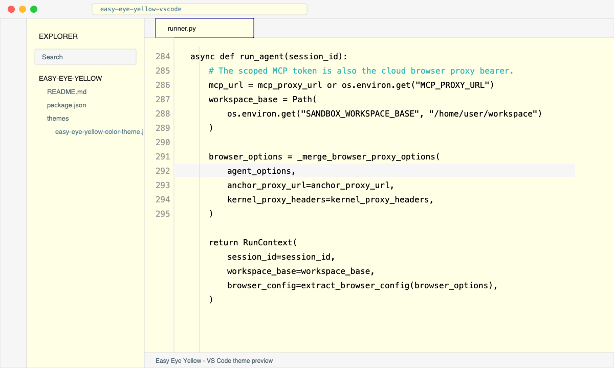

# Easy Eye Yellow for VS Code

A local VS Code theme extension based on IntelliJ IDEA's archived
`EasyEyesYellow` color scheme.



The original scheme came from the old Color Themes archive:

- Archive JAR: https://raw.githubusercontent.com/dvoyni/color-themes/master/db_dump/all-color-themes.jar
- File inside the JAR: `colors/EasyEyesYellow.xml`

## Install

Download the packaged VSIX from GitHub Releases instead of the source tree:

- [easy-eye-yellow-0.0.7.vsix](https://github.com/weiazm/easy-eye-yellow-vscode/releases/download/v0.0.7/easy-eye-yellow-0.0.7.vsix)

Then install it:

```sh
code --install-extension easy-eye-yellow-0.0.7.vsix --force
```

Choose `Easy Eye Yellow` from VS Code's color theme picker.

## Build Locally

```sh
npm run package
```

Generated `.vsix` packages are ignored by git. Release builds should be attached
to GitHub Releases.

## Theme Colors

The current theme keeps the original editor colors as closely as VS Code allows.

| Area or token | Preview | Color |
| --- | --- | --- |
| Editor background |  | `#FFFFE6` |
| Text foreground |  | `#000000` |
| Current line |  | `#F6F6F6` |
| Selection background |  | `#DCDCDC` |
| Line numbers |  | `#999999` |
| Keywords |  | `#0000A0` |
| Strings and regexp |  | `#018A8A` |
| Numbers and escapes |  | `#801F91` |
| Line comments |  | `#38B5B5` |
| Block and documentation comments |  | `#008040` |
| Documentation comment tags |  | `#004F27` |
| Classes and structs |  | `#800000` |
| Interfaces, enums, library symbols |  | `#18AADE` |
| Variables |  | `#5C8198` |
| Properties and fields |  | `#566874` |
| Parameters, constants, enum members |  | `#885D3B` |
| Function declarations |  | `#222222` |
| Method calls and punctuation groups |  | `#444444` |
| Default static methods |  | `#B0B0A3` |
| Metadata and preprocessor directives |  | `#8000FF` |
| Invalid and deprecated |  | `#CCCCCC` |

## Alignment Notes

The VS Code theme was checked against the archived `EasyEyesYellow.xml`
scheme. Every 6-digit color used by the original IDEA scheme is represented in
this theme, including less common values such as `#B0B0A3` for default static
methods and `#004F27` for IDEA's language-specific static method attributes.

Some IDEA color roles do not have exact VS Code equivalents because the two
editors expose different token and UI models. In those cases, this theme maps
the original role to the closest VS Code color key, TextMate scope, or semantic
token selector.
